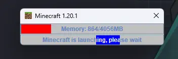

# Early Loading Bar

This mod add an early loading bar window for fabric.



Logically this mod can be used in any Minecraft Version since this mod only use Fabric APIs.

## Configuration

Config file will automatically generate at first launch.

```json5
{
  "logoPath": null,//(Optional) Window logo, default use internal Minecraft logo
  "barTitle": "Minecraft %version%",//The title, %version% = game version
  "barMessage": "Minecraft is launching, please wait",//The message, %version% = game version
  "memoryBarColor": "-65536",//Memory bar color in RGB format
  "messageBarColor": "16711935"//Message bar color in RGB format
}
```